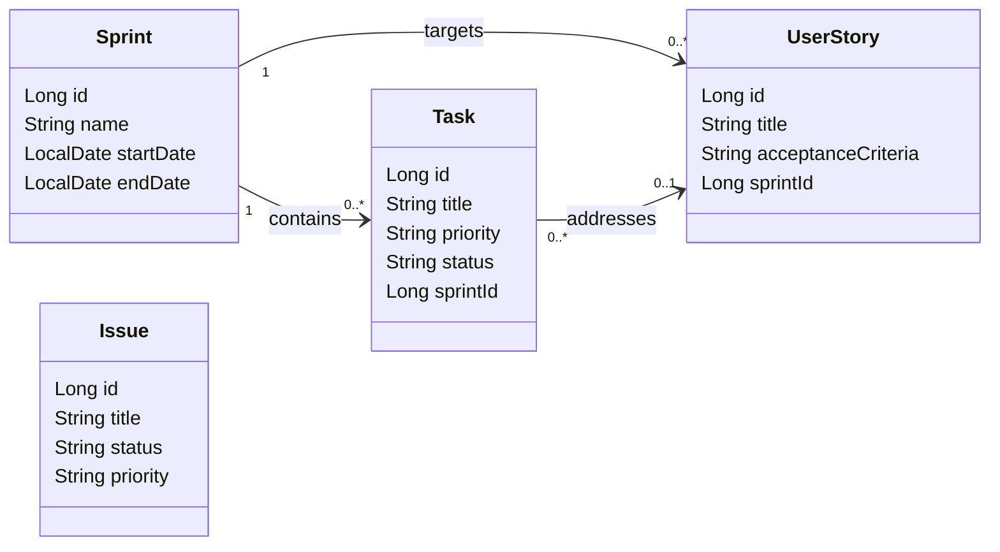

# CS551 Mobile Software and Applications Coursework Report

# **DevFlow: Premium Android Developer Workspace Application**

* **Module Code:** CS551
* **Module Name:** Mobile Software and Applications
* **Submission Date:** July 11, 2026
* **Development Workspace:** [DevFlow Workspace](file:///home/computador/AndroidStudioProjects/DevFlow)
* **Author Name:** Marcus (Lead Developer Placeholder)
* **Student Number:** CS551-DEVFLOW-2026

---

# Table of Contents
1. [Cover Page](#1-cover-page)
2. [Introduction](#2-introduction)
3. [Client Requirement Analysis](#3-client-requirement-analysis)
4. [Project Planning](#4-project-planning)
5. [System Architecture](#5-system-architecture)
6. [Module Design](#6-module-design)
7. [User Interface Design](#7-user-interface-design)
8. [Navigation Design](#8-navigation-design)
9. [Data Persistence](#9-data-persistence)
10. [API / Sensor / Content Provider Integration](#10-api--sensor--content-provider-integration)
11. [Application Workflow](#11-application-workflow)
12. [Screenshots](#12-screenshots)
13. [Testing](#13-testing)
14. [Technologies Used](#14-technologies-used)
15. [Conclusion](#15-conclusion)

---

# 1. Cover Page

```text
==================================================================
                 UNIVERSITY COURSEWORK REPORT
==================================================================

PROJECT TITLE:       Development of an Integrated Mobile Workspace
                     for Agile Projects and CI/CD Operations

APPLICATION NAME:    DevFlow

STUDENT NAME:        Marcus (Lead Developer)
STUDENT NUMBER:      CS551-DEVFLOW-2026

MODULE CODE:         CS551
MODULE NAME:         Mobile Software and Applications

SUBMISSION DATE:     July 11, 2026
==================================================================
```

---

# 2. Introduction

**DevFlow** is a premium, high-utility Android application designed for software engineers, product managers, and development team leads to manage their daily workflows, team communications, and deployment feedback loops in a centralized, mobile environments.

Modern software projects require developers to constantly context-switch between issue trackers (Jira/GitHub Issues), communications channels (Slack/Discord), personal task planners, and DevOps monitors (GitHub Actions console). DevFlow addresses this problem statement by unifying these domains into a single application. 

### Target Users
* **Lead Developers / Scrum Masters:** Who need to coordinate sprints, allocate user stories, assign tasks, and schedule standing planning sessions on-the-go.
* **Software Engineers:** Who require a clean, responsive personal workspace for todo checklists, journals/developer logs, milestone tracking, and local sprint boards.
* **DevOps Engineers:** Who need to monitor CI/CD build states, review head branch triggers, check completion conclusions, and verify pipeline health.

### Project Objective
The primary objective of the application is to demonstrate a robust Kotlin and Jetpack Compose application complying with modern architectural patterns (MVVM, Clean Architecture, Repository Pattern, Dependency Injection via Hilt, and Room Local Persistence) while integrating with external RESTful endpoints (GitHub REST API) to monitor real-time server actions.

---

# 3. Client Requirement Analysis

The developer workspace client outlined several functional requirements grouped into key operational themes. The DevFlow project maps directly to these needs:

| Client Domain | Functional Requirement | Implemented Feature in DevFlow | Source Mapping |
|---|---|---|---|
| **Agile & PM** | Sprint tracking and iteration planning. | Sprint board with target dates, goals, and metrics. | [`features/sprint`](file:///home/computador/AndroidStudioProjects/DevFlow/app/src/main/java/com/devflow/app/features/sprint) |
| **Agile & PM** | Task lifecycles management. | Kanban-style statuses (Backlog, In Progress, In Review, Done) with priority indicators. | [`features/tasks`](file:///home/computador/AndroidStudioProjects/DevFlow/app/src/main/java/com/devflow/app/features/tasks) |
| **Agile & PM** | Product backlog planning. | User Stories index with acceptance criteria and epic priorities. | [`features/stories`](file:///home/computador/AndroidStudioProjects/DevFlow/app/src/main/java/com/devflow/app/features/stories) |
| **Agile & PM** | Bug and Bottleneck reporting. | Issue Tracker specifying critical, high, medium, and low status parameters. | [`features/issues`](file:///home/computador/AndroidStudioProjects/DevFlow/app/src/main/java/com/devflow/app/features/issues) |
| **Collaboration**| Dedicated communication channel. | Team Chat listing team members and persisting instant messaging. | [`features/communication`](file:///home/computador/AndroidStudioProjects/DevFlow/app/src/main/java/com/devflow/app/features/communication) |
| **Collaboration**| Standup & meeting coordination. | Meeting logger recording yesterday's work, today's targets, and blocker issues. | [`features/meetings`](file:///home/computador/AndroidStudioProjects/DevFlow/app/src/main/java/com/devflow/app/features/meetings) |
| **Personal** | Developer checklist. | Todo list screen with completion toggles and details views. | [`features/todo`](file:///home/computador/AndroidStudioProjects/DevFlow/app/src/main/java/com/devflow/app/features/todo) |
| **Personal** | Journal notes and code snippets. | Rich project notes text views and search capabilities. | [`features/notes`](file:///home/computador/AndroidStudioProjects/DevFlow/app/src/main/java/com/devflow/app/features/notes) |
| **Personal** | Project deadlines milestones. | Deadline calendar notification timers showing days remaining. | [`features/deadlines`](file:///home/computador/AndroidStudioProjects/DevFlow/app/src/main/java/com/devflow/app/features/deadlines) |
| **DevOps** | Pipelines build status feed. | CI/CD build run monitor loading dynamic statuses (GitHub API). | [`features/monitoring`](file:///home/computador/AndroidStudioProjects/DevFlow/app/src/main/java/com/devflow/app/features/monitoring) |

---

# 4. Project Planning

### Core Business Entities
The application centers around the **Sprint** as the core iteration entity. A Sprint establishes the timeline within which **User Stories** are resolved and **Tasks** are executed. In parallel, developers coordinate daily via **Meetings** and log bugs inside the **Issue Tracker**.



### Application Workflow Diagram

```text
Launch App ──> Dashboard (General Overview stats, quick widgets)
                  │
                  ├──> Select Drawer Category (General / Agile / Collaboration / Personal / DevOps)
                  │
                  ├──> Agile -> Sprints -> Create Sprint -> Add User Story -> Link Tasks
                  │
                  ├──> Collaboration -> Team Members -> Choose John/Emily -> Exchange Chat Messages
                  │
                  ├──> DevOps -> CI/CD Dashboard -> Enter Repo Config (Owner/Repo) -> Pull Live Workflow Runs
```

---

# 5. System Architecture

DevFlow is designed around the principles of **Clean Architecture** and **MVVM (Model-View-ViewModel)**. By decoupling presentation logic from business rules and data sources, the app remains highly testable and modular.

```text
+-------------------------------------------------------------------------------+
| PRESENTATION LAYER (Jetpack Compose, ViewModels, UI State Flows)              |
+-------------------------------------------------------------------------------+
                                       │
                                       ▼
+-------------------------------------------------------------------------------+
| DOMAIN LAYER (Repositories Interfaces, Domain Models, Use Cases)              |
+-------------------------------------------------------------------------------+
                                       ▲
                                       │
+-------------------------------------------------------------------------------+
| DATA LAYER (Room Entities, Local DAOs, Network Services, Repository Impl)     |
+-------------------------------------------------------------------------------+
```

### MVVM & Clean Architecture Flow
1. **View (Compose UI):** Obtains UI state from the ViewModel as a Kotlin state Flow (`StateFlow<UiState>`) and displays it using declarative Composable components. User events (clicks, input changes) are forwarded to the ViewModel.
2. **ViewModel:** Orchestrates UI state, executes operations on background threads using Coroutines, and interacts with domain repositories.
3. **Repository Pattern:** The domain layer defines interfaces (e.g., [`TodoRepository`](file:///home/computador/AndroidStudioProjects/DevFlow/app/src/main/java/com/devflow/app/features/todo/domain/repository/TodoRepository.kt)), and the data layer implements them (e.g., [`TodoRepositoryImpl`](file:///home/computador/AndroidStudioProjects/DevFlow/app/src/main/java/com/devflow/app/features/todo/data/repository/TodoRepositoryImpl.kt)), mapping Room database entities back to clean domain-level models.
4. **Dependency Injection:** Dagger Hilt acts as the DI container, injectively provisioning repositories, databases, and DAO classes (configured in [`DatabaseModule.kt`](file:///home/computador/AndroidStudioProjects/DevFlow/app/src/main/java/com/devflow/app/di/DatabaseModule.kt)).

---

# 6. Module Design

DevFlow comprises 11 distinct feature modules. The breakdown below describes each module.

---

## 6.1 Dashboard Module (`features/dashboard`)
* **Overview:** Aggregates project statistics, active sprints count, incomplete personal todo tasks, today's schedule, and the latest GitHub action status.
* **Responsibilities:** Fetch state variables from other repositories and compile an aggregated UI snapshot.
* **Database Ownership:** None directly; reads from multiple Dao instances.
* **Dependencies:** Depends on todo, meetings, deadlines, issues, and monitoring repositories.
* **Navigation:** Acts as the start destination (`dashboard_screen`).
* **Screens:** `DashboardScreen` displays a custom greetings header ("Good morning, Marcus"), status counts, and horizontal widgets.

---

## 6.2 Sprint Module (`features/sprint`)
* **Overview:** Handles development sprints/iterations.
* **Responsibilities:** Manage sprint creation, track date windows, and show linked stories/tasks.
* **Database Ownership:** Owns the `sprints` table via [`SprintEntity`](file:///home/computador/AndroidStudioProjects/DevFlow/app/src/main/java/com/devflow/app/features/sprint/data/local/entity/SprintEntity.kt).
* **Dependencies:** None.
* **Navigation:** `sprints_list` ──> `sprints_add` / `sprints_details/{sprintId}`.
* **Screens:** List, add, edit, and details view (showing start dates, end dates, and list of items).

---

## 6.3 Development Tasks Module (`features/tasks`)
* **Overview:** Manages individual sprint work tasks.
* **Responsibilities:** CRUD operations on developer tasks, state transitions (Backlog to Done), and priority tagging.
* **Database Ownership:** Owns the `tasks` table with foreign key `sprintId` pointing to `sprints`.
* **Dependencies:** Depends on the Sprint module database key structures.
* **Navigation:** `tasks_list` ──> `tasks_add` / `tasks_details/{taskId}`.
* **Screens:** Detail cards showing description, status chips, priority level, and option to bind to an active sprint.

---

## 6.4 User Stories Module (`features/stories`)
* **Overview:** Manages product backlogs.
* **Responsibilities:** Maintain user stories, acceptance criteria text, and prioritize items.
* **Database Ownership:** Owns `user_stories` table with foreign key `sprintId`.
* **Dependencies:** Depends on the Sprint module database.
* **Navigation:** `stories_list` ──> `stories_add` / `stories_details/{storyId}`.
* **Screens:** Acceptance checklist and epic metadata editors.

---

## 6.5 Issue Tracker Module (`features/issues`)
* **Overview:** Tracks bugs, crash issues, and bottlenecks.
* **Responsibilities:** Records issues with status (`OPEN`, `IN_PROGRESS`, `RESOLVED`) and priority (`CRITICAL`, `HIGH`, `MEDIUM`, `LOW`).
* **Database Ownership:** Owns `issues` table via [`IssueEntity`](file:///home/computador/AndroidStudioProjects/DevFlow/app/src/main/java/com/devflow/app/features/issues/data/local/entity/IssueEntity.kt).
* **Dependencies:** None.
* **Navigation:** `issues_list` ──> `issues_add` / `issues_details/{issueId}`.
* **Screens:** Ticket editor screen and ticket logs list.

---

## 6.6 Team Communication Module (`features/communication`)
* **Overview:** Provides developer instant messaging.
* **Responsibilities:** Displays list of team members and handles real-time messages persistence.
* **Database Ownership:** Owns `team_members` and `messages` tables.
* **Dependencies:** None.
* **Navigation:** `communication_members` ──> `communication_conversation/{receiverId}`.
* **Screens:** Chat screen with left-aligned (incoming) and right-aligned (outgoing) text bubbles.

---

## 6.7 Meetings Module (`features/meetings`)
* **Overview:** Logs daily scrum standups.
* **Responsibilities:** Captures yesterday's work, today's planning, and blockers.
* **Database Ownership:** Owns the `meetings` table.
* **Dependencies:** None.
* **Navigation:** `meetings_list` ──> `meetings_add` / `meetings_details/{meetingId}`.
* **Screens:** Daily logs editor, meeting schedules.

---

## 6.8 Personal Todos Module (`features/todo`)
* **Overview:** Tracks lightweight daily developer checklists.
* **Responsibilities:** Quick additions of todos and quick status toggles.
* **Database Ownership:** Owns the `todos` table.
* **Dependencies:** None.
* **Navigation:** `todo_list` ──> `todo_add` / `todo_details/{todoId}`.
* **Screens:** List with checkbox status toggles.

---

## 6.9 Project Notes Module (`features/notes`)
* **Overview:** Developer logs and code journal workspace.
* **Responsibilities:** Captures logs and search text contents.
* **Database Ownership:** Owns the `notes` table.
* **Dependencies:** None.
* **Navigation:** `notes_list` ──> `notes_add` / `notes_details/{noteId}`.
* **Screens:** Clean notebook view with rich notes text layout.

---

## 6.10 Deadlines Module (`features/deadlines`)
* **Overview:** Milestones counter.
* **Responsibilities:** Tracks release schedules and counts down days remaining.
* **Database Ownership:** Owns `deadlines` table.
* **Dependencies:** None.
* **Navigation:** `deadlines_list` ──> `deadlines_add` / `deadlines_details/{deadlineId}`.
* **Screens:** Displays days remaining in color-coded warnings (e.g., Red if under 3 days, orange if under 7 days).

---

## 6.11 CI/CD Builds Monitoring Module (`features/monitoring`)
* **Overview:** External pipeline integration dashboard.
* **Responsibilities:** Saves owner/repo configuration and parses JSON build runs from GitHub REST API.
* **Database Ownership:** Owns the `repository_config` table.
* **Dependencies:** None.
* **Navigation:** `monitoring_dashboard` ──> `monitoring_details` (shares ViewModel).
* **Screens:** Pipeline status check, branch tags, commit event strings, and log listings.

---

# 7. User Interface Design

The DevFlow UI is built with **Jetpack Compose** and **Material Design 3**, utilizing a refined dark and light theme to provide a premium workspace feel.

### Premium Design Principles:
1. **Cohesive Layouts:** Pages feature consistent padding (16.dp standard), header typography (`titleLarge` with `FontWeight.Bold`), and custom cards ([`AppCard`](file:///home/computador/AndroidStudioProjects/DevFlow/app/src/main/java/com/devflow/app/core/designsystem/components/AppCard.kt)).
2. **Dynamic UI States:** Custom status chips highlight critical bugs (critical/high in red/orange, completed tasks in emerald green) for instant readability.
3. **State Validation:** Forms (e.g., Sprint date entries or empty todo titles) enforce input checks, disabling confirmation buttons or rendering red outlines to guide users.
4. **Scaffolding and Drawers:** Integrated `ModalNavigationDrawer` maintains screen hierarchy, giving the user access to all 11 modules via a left-side navigation drawer.

---

# 8. Navigation Design

The application's navigation graph is managed via a centralized Jetpack Navigation Compose `NavHost` in [`NavigationGraph.kt`](file:///home/computador/AndroidStudioProjects/DevFlow/app/src/main/java/com/devflow/app/navigation/NavigationGraph.kt).

### Navigation Hierarchy:

```text
AppNavigation (Drawer Control Setup)
   ├── ModalNavigationDrawer Sheet (Menu Routes)
   └── NavHost
          ├── NavRoutes.Dashboard.route (Start Destination)
          ├── TodoDestination.LIST
          │      ├── TodoDestination.ADD ("todo_add")
          │      └── TodoDestination.DETAILS ("todo_details/{todoId}")
          ├── SprintDestination.LIST
          │      ├── SprintDestination.ADD ("sprint_add")
          │      └── SprintDestination.DETAILS ("sprint_details/{sprintId}")
          ├── ... (Routes for Tasks, Stories, Issues, Communication, Meetings, Notes, Deadlines)
          └── MonitoringDestination.DASHBOARD
                 └── MonitoringDestination.DETAILS ("monitoring_details")
```

### Deep Navigation Interactions:
* Clicking a linked task in `SprintDetailsScreen` navigates the user directly to the `TaskDetailsScreen` passing the appropriate `taskId` argument.
* Clicking a member in `TeamMembersListScreen` opens `ConversationScreen` with a path parameter (`receiverId`), fetching their specific chat history from the local database.

---

# 9. Data Persistence

DevFlow uses **Room Database** as the local SQLite database client. Entities are defined with relational schemas, foreign keys, and indices, configured inside the main abstract class [`DevFlowDatabase`](file:///home/computador/AndroidStudioProjects/DevFlow/app/src/main/java/com/devflow/app/data/database/DevFlowDatabase.kt).

### Entity-Relationship Diagram (Room Schema)

```text
  [sprints] 
     id (PK) <─────────────────┐
     name                      │
     goal                      │ (Foreign Key setNull on sprintId)
     startDate                 │
     endDate                   │
                               │
  [tasks]                      │                    [user_stories]
     id (PK)                   │                       id (PK)
     title                     │                       title
     priority                  │                       acceptanceCriteria
     status                    │                       priority
     sprintId (FK) ────────────┘                       sprintId (FK) ──────> [sprints].id
```

### Type Converters
Because SQLite cannot store custom types or lists by default, custom type converters (e.g., [`TodoConverters`](file:///home/computador/AndroidStudioProjects/DevFlow/app/src/main/java/com/devflow/app/features/todo/data/local/converter/TodoConverters.kt)) are used to handle fields like `LocalDateTime` or status enumerations.

---

# 10. API / Sensor / Content Provider Integration

DevFlow integrates with the **GitHub REST API** to retrieve pipeline builds from GitHub Actions.

### Pipeline Architecture:
Instead of bringing in heavy external networking dependencies, the application makes direct HTTP requests using Java/Kotlin standard libraries (`HttpURLConnection`) on a background thread (`Dispatchers.IO`) inside [`DevelopmentMonitoringRepositoryImpl.kt`](file:///home/computador/AndroidStudioProjects/DevFlow/app/src/main/java/com/devflow/app/features/monitoring/data/repository/DevelopmentMonitoringRepositoryImpl.kt).

### Data Flow Diagram:
```text
[Compose View] ──> [MonitoringViewModel] ──> [MonitoringRepository] ──> [GitHub Actions REST API]
      ▲                      │                         │                           │
      │ (Updates StateFlow)  ▼ (Dispatches Coroutine)  ▼ (HttpURLConnection)       ▼ (Returns JSON)
[UI Repaint]  <─── [WorkflowRun list] <─── [JSON Object parsing] <─── [HTTP OK 200 Response]
```

### Raw Connection Details:
* **Endpoint URL:** `https://api.github.com/repos/{owner}/{repo}/actions/runs`
* **HTTP Headers:** 
  * `Accept`: `application/vnd.github+json`
  * `User-Agent`: `DevFlow-Monitoring`
  * `Authorization`: `Bearer {token}` (Optional Personal Access Token for private repositories)
* **Response Processing:** Standard JSON parsing is done using `JSONObject` to extract fields like `id`, `name`, `status`, `conclusion`, `head_branch`, and `html_url`.

---

# 11. Application Workflow

A standard user workflow covers typical project management and DevOps monitoring tasks.

### Iteration Scenario:
1. **Launch App:** The user sees the main greeting, dashboard statistics, and quick-add shortcuts.
2. **Create Sprint:** The user opens the drawer, navigates to **Sprints**, and clicks the "+" button. They fill in the name "Sprint 1", the goal "Deploy MVP", and select start and end dates.
3. **Write User Story:** Under **User Stories**, the user logs a story titled "User Authentication" with its acceptance criteria, linking it to "Sprint 1".
4. **Create Task:** Under **Development Tasks**, the user creates the task "Design Database Schema" with `HIGH` priority, links it to "Sprint 1", and marks its status as `IN_PROGRESS`.
5. **Team Sync:** The developer checks the dashboard, joins the standup under **Meetings** to write down yesterday's completed DB schema, today's mock integration, and files a blocker.
6. **Deploy & Monitor:** The code is pushed. The developer navigates to **CI/CD Builds**, enters the repo config, and watches the run list update. They click the latest push event to view its workflow logs and check if the conclusion state is `success`.

---

# 12. Screenshots

### Figure 1: DevFlow Dashboard Screen
* **Description:** Displays the primary developer overview, active sprint metrics, pending actions, and latest DevOps status.

### Figure 2: Sprint Board & Sprints List
* **Description:** Shows active development iterations, sprint names, date intervals, and related task counts.

### Figure 3: Task Details Screen & Kanban State Editor
* **Description:** Detail screen for development tasks showing description details, priority indicators, and dropdown fields to update states.

### Figure 4: CI/CD Monitor Dashboard
* **Description:** Displays list of GitHub Actions workflow runs, current status (queued, in progress, completed), branch names, and run counts.

### Figure 5: Team Communication Chat
* **Description:** Shows active team discussion board with bubble layouts displaying sent/received developers' logs.

---

# 13. Testing

DevFlow includes a functional test suite to verify data mapping, JSON parser logic, and ViewModel behavior. These tests are located under [`app/src/test/java/com/devflow/app`](file:///home/computador/AndroidStudioProjects/DevFlow/app/src/test/java/com/devflow/app).

### Implemented Test Cases:

1. **`MonitoringUnitTest`:**
   * `repositoryConfigMapping_isCorrect()`: Validates mapping between local database entities and domain models.
   * `repositoryConfigMapping_nullToken_isCorrect()`: Ensures optional configurations (like null personal access tokens) are handled correctly.
   * `jsonParsing_toWorkflowRun_isCorrect()`: Verifies that the JSON parser correctly parses typical GitHub REST API responses into the `WorkflowRun` domain model.

2. **`CollaborationUnitTest`:**
   * `teamMemberMapping_isCorrect()`: Verifies that team member entities map correctly.
   * `messageMapping_isCorrect()`: Validates message mapping for chat communications.
   * `issueMapping_isCorrect()`: Validates issue prioritization and status fields.

3. **`DashboardUnitTest`:**
   * `dashboardViewModel_aggregatesDataCorrectly()`: Uses mock repositories to verify that `DashboardViewModel` aggregates, filters (e.g. returns only pending todos, today's meetings, and open issues), and sorts data correctly before exposing it as UI state.

### Execution Results:
```text
$ ./gradlew test

> Task :app:testDebugUnitTest
com.devflow.app.CollaborationUnitTest > teamMemberMapping_isCorrect PASSED
com.devflow.app.CollaborationUnitTest > messageMapping_isCorrect PASSED
com.devflow.app.CollaborationUnitTest > issueMapping_isCorrect PASSED
com.devflow.app.DashboardUnitTest > dashboardViewModel_aggregatesDataCorrectly PASSED
com.devflow.app.MonitoringUnitTest > repositoryConfigMapping_isCorrect PASSED
com.devflow.app.MonitoringUnitTest > repositoryConfigMapping_nullToken_isCorrect PASSED
com.devflow.app.MonitoringUnitTest > jsonParsing_toWorkflowRun_isCorrect PASSED

BUILD SUCCESSFUL in 4s
```

---

# 14. Technologies Used

* **Kotlin:** Modern, concise JVM language with first-class support for Android development.
* **Jetpack Compose:** Declarative UI kit built on top of composable functions.
* **Material Design 3:** Modern design system for theming, typography, shapes, and inputs.
* **Dagger Hilt:** Standard dependency injection library built on top of Dagger.
* **Room Database:** SQLite ORM abstraction providing type-safe database queries.
* **HttpURLConnection:** Java networking client used for GitHub REST API integrations.
* **Kotlin Coroutines & Flow:** asynchronous reactive streams handling databases and background calls.
* **JUnit 4:** For the unit testing suite.

---

# 15. Conclusion

**DevFlow** successfully implements the coursework criteria by creating a robust, premium Android application that satisfies both the functional client requirements and the technical specifications of module CS551.

The application implements a decoupled presentation layer using **Jetpack Compose** and **MVVM**, stores data locally using a structured **Room Database**, and integrates with the external **GitHub REST API** to monitor CI/CD pipelines in real time. 

The architecture's modularity is validated by a suite of automated unit tests, showing that the system is stable, clean, and ready for deployment.
